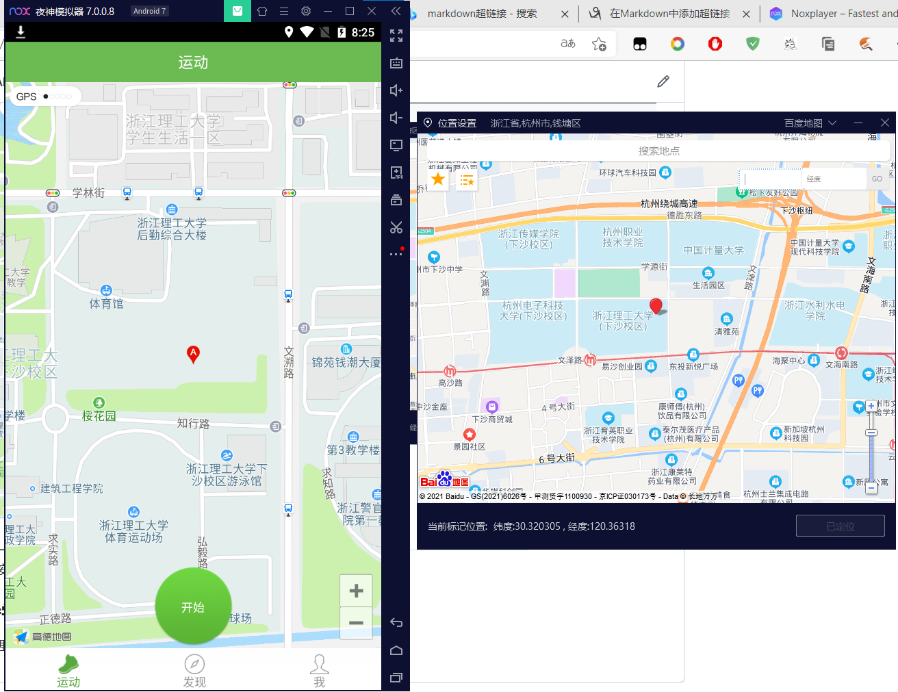

# running
###基于手机模拟器虚拟定位实现自动跑圈
###需求python依赖模块
---pyautogoi
---keyboard
###使用方法
1.双击Main.py或者在终端运行Main.py
2.打开NOX安卓模拟器，打开跑步软件和虚拟定位服务，如下图

3.注意要选中输入纬度的文本框，鼠标的位置要在结束跑步的按钮上
4.单击F1启动脚本
###已知bug
1.当生成的两个点过近时，脚本会失效，解决办法：尽量不要分割很多点（推荐：16个点）
2.第一次选中的点如果跟第一个生成的点很近时，脚本会失效，解决办法：第一次在区域的左上角稍稍往外的点定位一次
###支持学校
浙江理工大学
